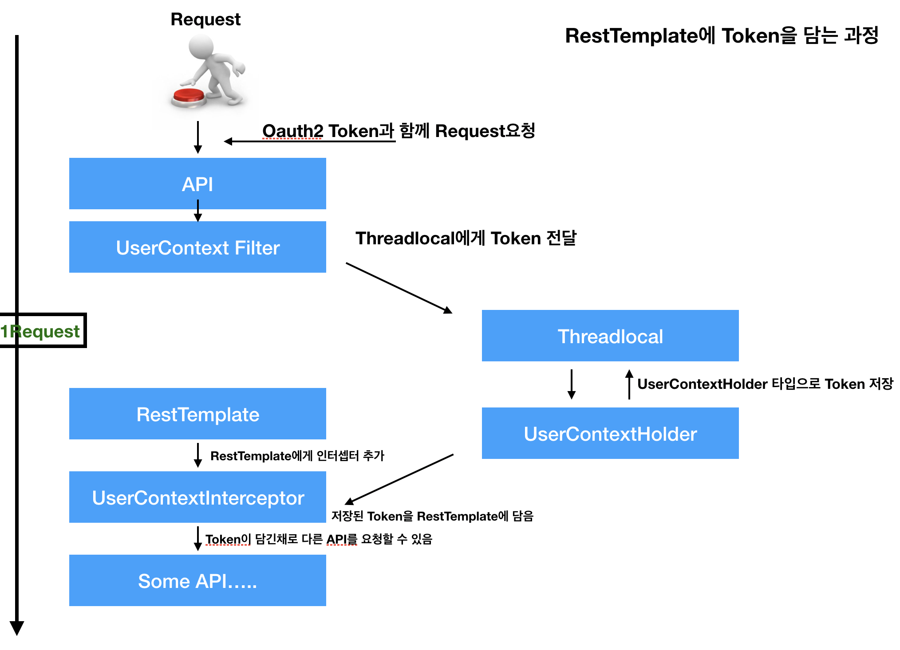

## 📖 기술스택 

- SpringBoot

- MicroService Architecture

- Oauth2 cloud
- JWT
- Docker
- Netflix Eureka
- Spring colud Config Server
- Netflix Hystrix
- Netflix Zuul(API Gateway)
- Apache Kafka
- Reactor3

## 🚀 Trouble Shooting

- MSA 구조에서 MockMvc를 위한 OAuth2 Test 알아보기 / 컨트롤러단에 Authentication 객체가 주입이 안된다. ㅎ 다른에제들은 monolithic 구조라...찾아보기 힘들다.
- MSA에서 JPA 맵핑하는법.. 서로 Entity들이 분리되어 있어서 관계매핑하기가 어려운데, TIP같은것도 정리하면 좋을듯.

## 포스팅할거

- 스프링 슬루쓰
- 스레드 로컬

## RestTemplate에 Oauth2 토큰을 함께 보내는 방법

